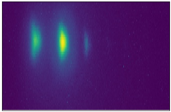
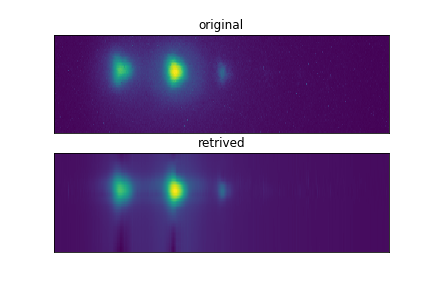
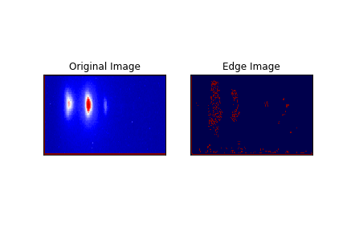
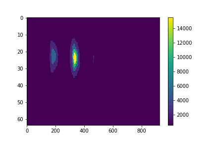

# image processing of high harmonics image
- image from high harmonics experiment.

- pca reduce image size while retain important profile.

- detect edge with canny

- compress image with kmeans

